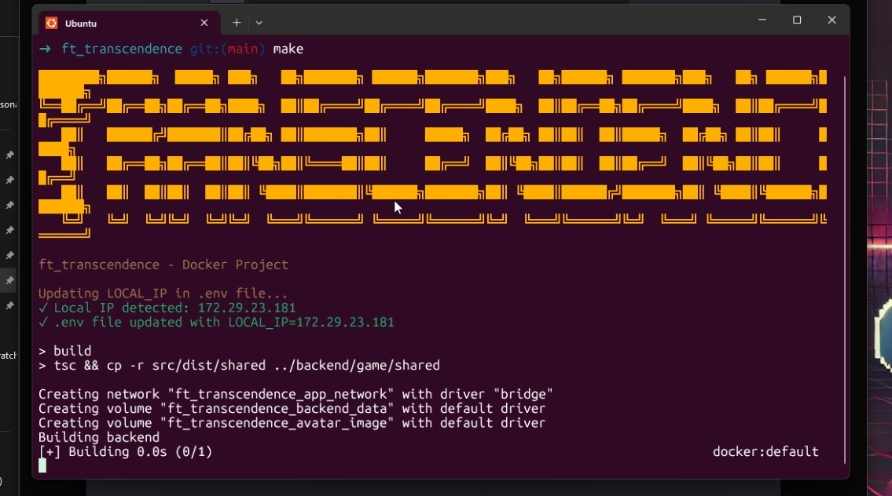
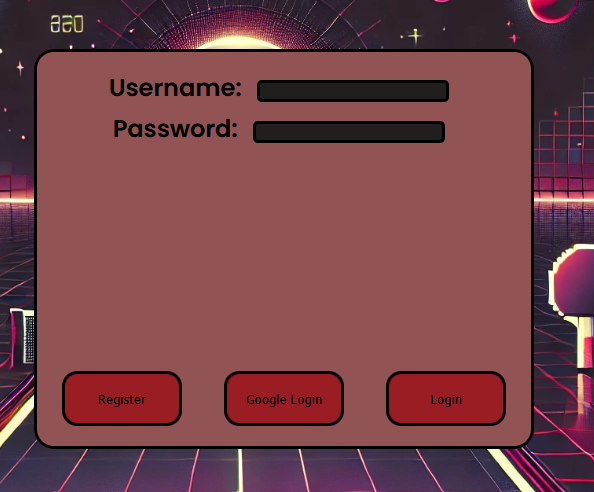
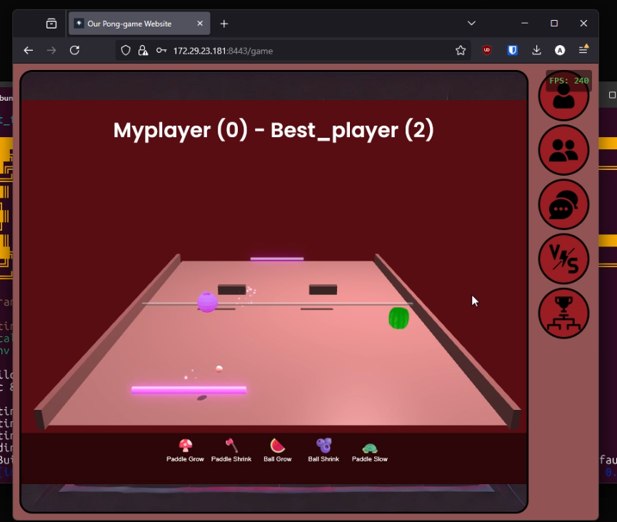
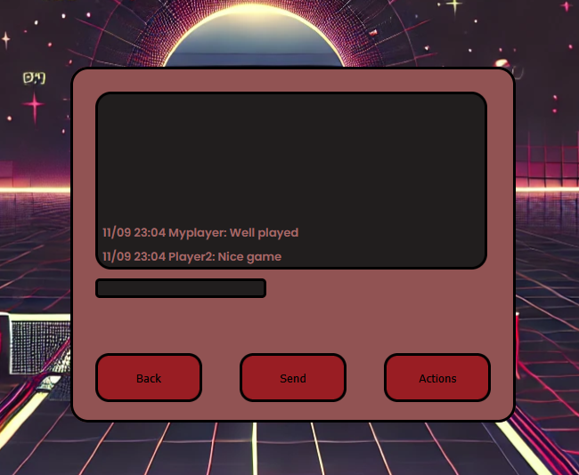
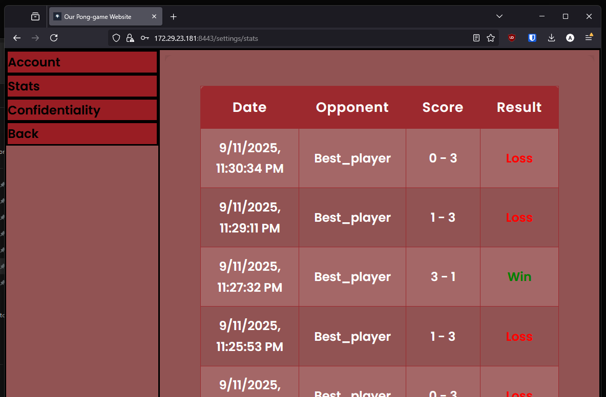

# 🎮 ft_transcendence
## 🚀 Présentation

Le projet est conçu comme un **site web single-page (SPA)**, combinant **frontend moderne**, **backend robuste**, et **communication en temps réel** via **WebSockets**.

---

## 🛠️ Fonctionnalités
### **✅ Fonctionnalités Obligatoires (Mandatory Features)**

- 🎮 **Jeu de Pong en ligne** (1v1 sur le même clavier).  
- 🏆 **Système de tournois** avec matchmaking automatique.  
- 🔐 **Authentification & Gestion des utilisateurs** (alias temporaires pour les tournois).  
- 📊 **Aucune erreur critique** ne doit être présente sur le site.  
- 🌍 **Compatibilité avec Mozilla Firefox (dernière version stable)**.  
- 🐳 **Déploiement via Docker** avec une seule commande pour exécuter le projet.  
- 🔒 **Sécurité des données et des connexions** (HTTPS obligatoire, validation des entrées utilisateurs).  

---

### **📌 Modules (Fonctionnalités Additionnelles)**  
#### 🟢 Modules Majeurs ✅  
- ✅ Utilisation d’un framework backend (Fastify, Node.js)
- ✅ Gestion complète des utilisateurs (authentification, avatars, stats, amis)
- ✅ Sécurisation avancée (JWT, 2FA)
- ✅ Authentification Google (OAuth)
- ✅ Remote player (matchs en ligne, WebSocket)
- ✅ Live chat (public + privé, temps réel)
- ✅ Intégration BabylonJS (rendu 3D du jeu)

#### 🟡 Modules Mineurs ✅  
- ✅ Personnalisation du jeu (Game Customization)
- ✅ Utilisation d’une base de données (SQLite)
- ✅ Compatibilité navigateur (Browser Compatibility)
- ✅ Conformité RGPD (mentions légales, gestion des données)
- ✅ Multi-device sur téléphone (responsive + synchronisation de session)

---

## 📌 Technologies Utilisées
### **Frontend**
- TypeScript (vanilla, sans framework)
- Tailwind CSS (UI responsive)
- WebSockets (chat, matchmaking, jeu en temps réel)
- Google OAuth 2.0 (connexion via compte Google)
- BabylonJS (rendu 3D du jeu dans le navigateur)

### **Backend**
- Node.js avec Fastify (serveur API REST & WebSocket)
- SQLite (base de données légère embarquée)
- JWT (authentification sécurisée par token)
- 2FA (authentification à deux facteurs via TOTP)
- Docker (conteneurisation et orchestration du projet)

### **Jeu Multijoueur & Communication**
- WebSockets (temps réel pour jeu, matchmaking et chat)
- Architecture orientée événements (gestion des états de partie, joueurs en ligne, etc.)
- Prise en charge du multi-device (desktop/mobile)
- Respect des bonnes pratiques RGPD (gestion des données utilisateurs)

## 📜 Licence
Ce projet est développé dans le cadre du cursus **42** et suit ses directives pédagogiques.  
